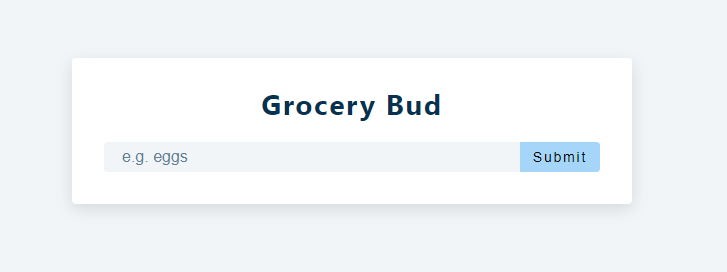
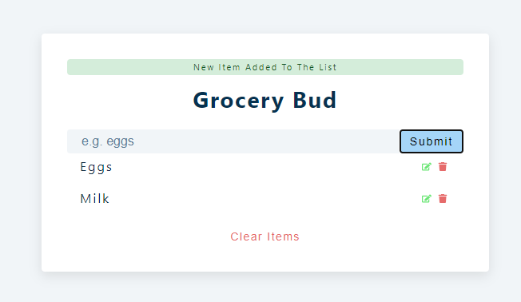
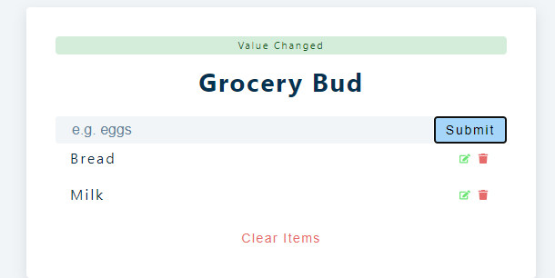
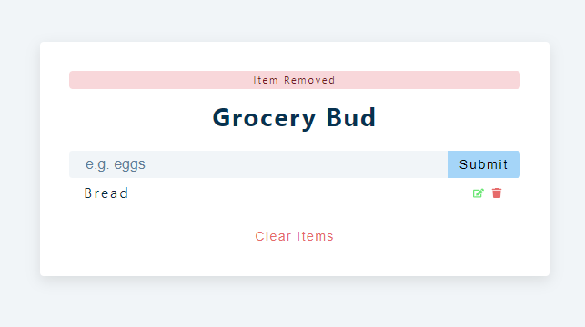
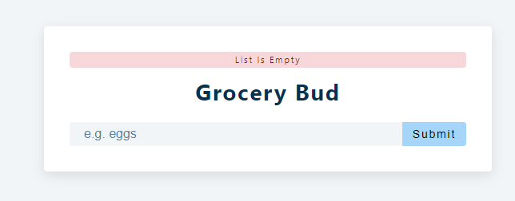

## React Project 7

<hr>

#### _**GROCERY LIST**_

The items in the List gets stored in _Local storage_

To view in your local system, fork the project and install the dependencies using the below commands:

```shell
>> npm install
>> npm start
```

<br>

<p align="center">
  
</p>

<p align="center">
  
</p>

- You can also **_edit_** a particular item.

<p align="center">
  
</p>

<p align="center">
  
</p>

<p align="center">
  
</p>
